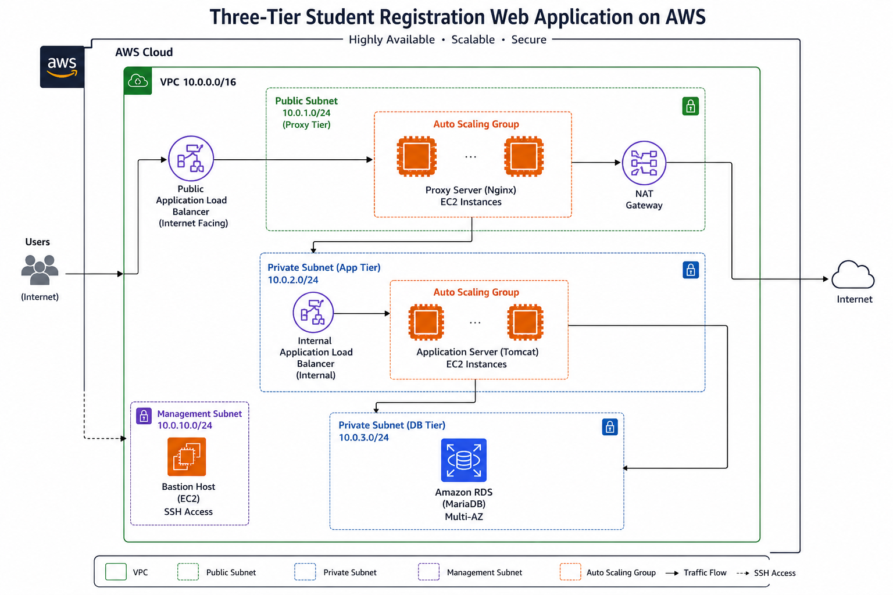
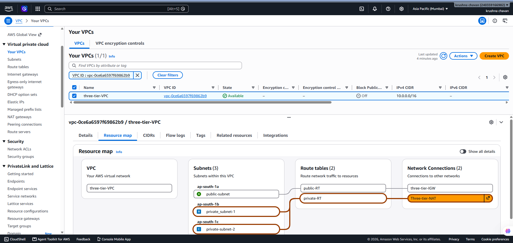
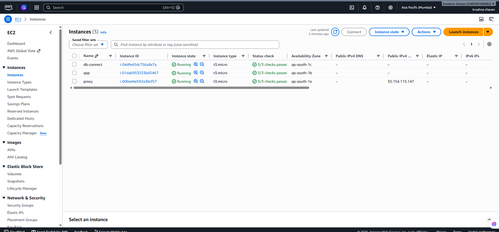
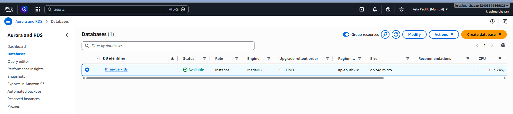
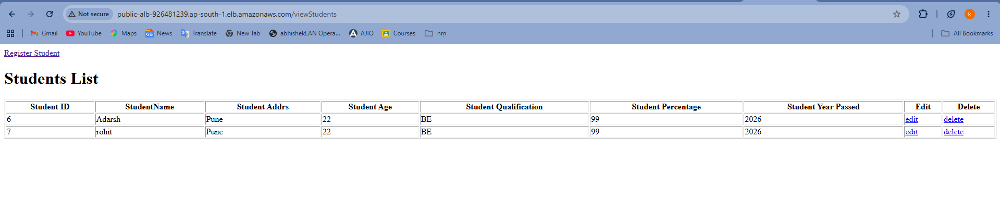
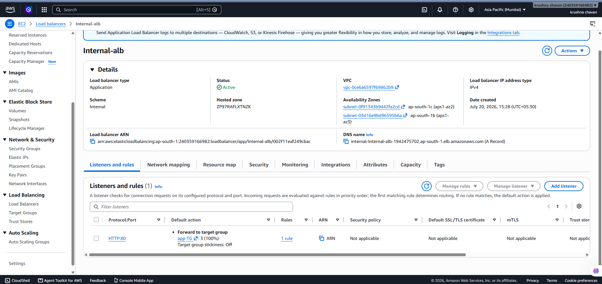
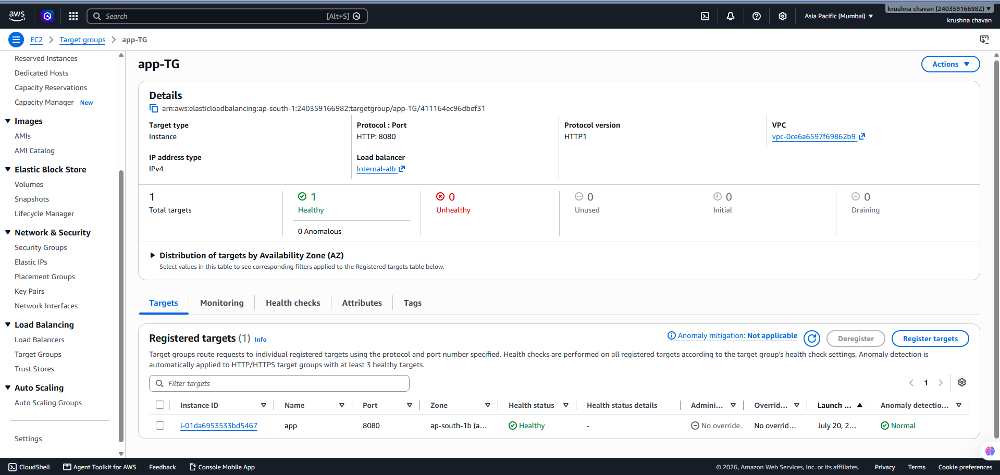
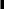
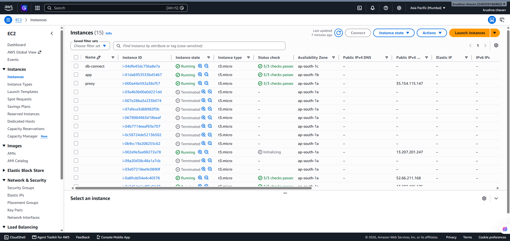
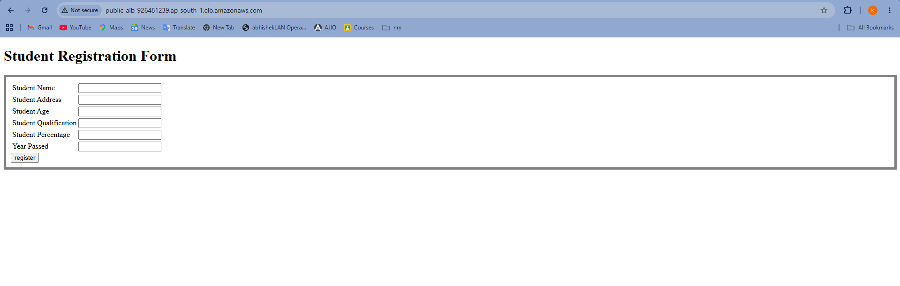

# # # Deploying a Student Registration System on AWS – Three-Tier Architecture
A production-oriented three-tier web application deployed on AWS that demonstrates secure network design, reverse proxy implementation, load balancing, high availability, and automatic instance recovery using Auto Scaling.

The infrastructure separates the presentation, application, and database layers into dedicated network tiers while following AWS best practices for scalability, security, and fault tolerance.

---

# Architecture



---

# Project Overview

This project implements a three-tier architecture consisting of:

- **Presentation Layer** – Public Application Load Balancer and Nginx Reverse Proxy
- **Application Layer** – Apache Tomcat running on Amazon EC2
- **Database Layer** – Amazon RDS (MariaDB)

Client requests are received through a Public Application Load Balancer, forwarded to a reverse proxy running inside an Auto Scaling Group, and then routed through an Internal Application Load Balancer to the Tomcat application server. The application communicates securely with an Amazon RDS database deployed in a private subnet.

---

# Infrastructure

## Custom VPC

The complete infrastructure is deployed inside a custom Amazon VPC designed with network isolation and secure communication.

**Components**

- Public Subnet
- Private Application Subnet
- Private Database Subnet
- Internet Gateway
- NAT Gateway
- Route Tables
- Security Groups



---

## Compute Layer

The application is hosted on Amazon EC2 instances.

### Reverse Proxy

- Nginx
- Public Subnet
- Managed by Auto Scaling Group

### Application Server

- Apache Tomcat
- Java Web Application
- Private Subnet



---

## Database Layer

The backend database is hosted on Amazon RDS inside a private subnet.

**Database**

- Amazon RDS
- MariaDB
- Private Connectivity
- Secure Database Access



---

# Load Balancing

## Public Application Load Balancer

The Public Application Load Balancer acts as the internet-facing entry point and forwards client requests to the reverse proxy layer.



---

## Internal Application Load Balancer

The Internal Application Load Balancer receives requests from the reverse proxy and distributes traffic to the Tomcat application server.



---

# Health Monitoring

Application availability is monitored using Target Groups and health checks to ensure requests are routed only to healthy resources.



---

# Auto Scaling

The reverse proxy layer is configured using an Auto Scaling Group to improve availability and eliminate single points of failure.

### Implemented Features

- Launch Template
- Automatic Instance Replacement
- Elastic Load Balancer Integration
- Health Checks
- High Availability



---

# Self-Healing Validation

To verify fault tolerance, an Auto Scaling instance was intentionally terminated.

The Auto Scaling Group automatically:

- Detected the instance failure
- Launched a replacement instance
- Registered the new instance with the Target Group
- Restored the desired capacity

This validated the self-healing capability of the infrastructure without impacting application availability.



---

# Final Deployment

The Student Registration application is successfully accessible through the Public Application Load Balancer while all backend services remain securely deployed within private network tiers.



---

# AWS Services Used

- Amazon VPC
- Amazon EC2
- Amazon RDS (MariaDB)
- Application Load Balancer (Public)
- Application Load Balancer (Internal)
- Auto Scaling Group
- Launch Template
- Target Groups
- Amazon Machine Image (AMI)
- Internet Gateway
- NAT Gateway
- Route Tables
- Security Groups

---

# Key Features

- Three-Tier AWS Architecture
- Reverse Proxy using Nginx
- Public & Internal Application Load Balancers
- Secure Network Segmentation
- Amazon RDS Integration
- Auto Scaling
- Self-Healing Infrastructure
- High Availability
- Health Check Monitoring

---

# Skills Demonstrated

- AWS Networking
- Linux Administration
- Amazon EC2
- Amazon RDS
- Application Load Balancer
- Auto Scaling
- Nginx Reverse Proxy
- Apache Tomcat
- Infrastructure Troubleshooting
- High Availability Design

---

# Repository Structure

```
.
├── images
│   ├── 01-architecture-diagram.png
│   ├── 02-vpc-network.png
│   ├── 03-ec2-instances.png
│   ├── 04-rds-instance.png
│   ├── 05-internal-alb-active.png
│   ├── 06-app-target-group-healthy.png
│   ├── 07-public-alb-working.png
│   ├── 08-ASG-Healthy-Targets.png
│   ├── 09-ASG-Auto-Healing.png
│   └── 10-Final-Working-Project.png
└── README.md
```

---

# Conclusion

This project demonstrates the deployment of a scalable and secure three-tier web application on AWS using industry-standard cloud services. It integrates load balancing, reverse proxy architecture, Auto Scaling, and Amazon RDS to provide a resilient infrastructure capable of handling failures through automatic instance replacement while maintaining application availability.